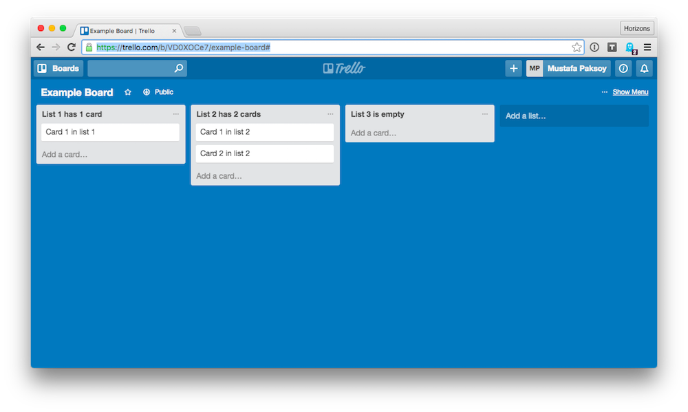

# Horizonello: a Horizons Trello Clone

## Table of contents

1. [Intro](#intro)
1. [Your tasks](#your-tasks)
1. [Submitting](#submitting)
1. [Evaluation](#evaluation)
1. [Running project](#running-project)
1. [Schema](#schema)
1. [Project Layout](#project-layout)
1. [API Endpoints](#api-endpoints)
  1. [Get all lists](#get-all-lists)
  1. [Get one list](#get-one-list)
  1. [Create new list](#create-new-list)
  1. [Update existing list](#update-existing-list)

## Intro

Your mission, should you choose to accept it, is to build a simplified
[Trello](http://trello.com) clone.

Trello is a simple task management tool with three components: boards, lists and cards.
Each board has multiple lists, each list has multiple cards, and cards have names. 
[Here's what Trello looks like.](https://trello.com/b/VD0XOCe7/example-board)



In this exercise, we'll be building **a single Trello-like board.**

## Your tasks

Don't try to do all of these tasks at once. Tackle them one at a time and move
on once you've completed task. It's OK if you don't complete all tasks, we give
partial credit :white_check_mark:.

Your solutions **should store and read data from the server**. API endpoints
listed below may be helpful for this. You can render your interface on the
client or on the server.

The app currently has no styling; it's up to you to add style and interactivity
to it as you go through these tasks. Be creative!

 1. View lists, create new list **\[frontend\]**
    <br> Allow users to view and
    create lists. Lists should be displayed as vertical columns in a
    Trello-like manner.
    <br>See: `GET /api/lists` and `POST /api/lists`.
 1. Fix `POST /api/list/:id` endpoint **\[backend\]**
    <br> There's a bug :beetle: in the API endpoint for updating `List`s in
    [`app.js`](app.js). Find it and fix it.
 1. Create new card in a list **\[frontend\]**
    <br> Allow users to create new cards in existing lists.
    <br>See: `POST /api/lists/:id`.
 1. Rename list **\[frontend\]**
    <br>Allow users to rename existing lists.
    <br>See: `POST /api/lists/:id`.
 1. Change card contents **\[frontend\]**
    <br>Allow users to change the contents of cards.
    <br>See: `POST /api/lists/:id`.
 1. Delete card **\[frontend\]**
    <br>Allow users to delete single cards.
    <br>See: `POST /api/lists/:id`.
 1. Move cards **\[frontend\]**
    <br>Allow users to move cards within and between lists.
    <br>See: `POST /api/lists/:id`.
 1. Reorder lists **\[frontend\]**
    <br>Allow users to reorder whole lists. You can use drag-and-drop or buttons.
    <br>See: `POST /api/lists/:id`.
 1. Implement `DELETE /api/lists/:id` **\[backend\]**
    <br>Create a new Express endpoint that takes a `DELETE` request and an `id`
    and deletes a single list.  This endpoint should return `404 Bad Request`
    if list with `id` can't be found. 
    <br>See: function `storage.del(kind, id)` in `storage.js`
 1. Delete list **\[frontend\]**
    <br>Allow users to delete whole lists.
    <br>See: `DELETE /api/lists/:id`.

Legend:

 * **\[frontend\]**: Task involves work in the browser with HTML, CSS and JavaScript.
 * **\[backend\]**: Task involves work in the server with [Node][node] and [Express][express]

## Submitting

We recommend that you **don't** publicly fork this repository.

 1. Make sure all your changes are committed to `git`.

    ```bash
    $ git status
    On branch master
    nothing to commit, working directory clean
    ```

 1. Create a zip archive of your project.

    ```bash
    $ git archive master --format zip -o "horizonello-[YOUR NAME].zip"
    ```

 1. Email us `horizonello-[YOUR NAME].zip`.

## Evaluation

You work will be evaluated based on the following criteria (in decreasing order of importance):

 * Correctness (most important): The features you implement work correctly.
   There are no errors in the console. It's not easy to make your code break.
 * Completeness: Every feature is implemented.
 * Visual styling and ease of use (least important): The user interface is easy
   to use and looks good.

:exclamation: **Important:** Your app **MUST** start successfully with
`npm install && npm start` command.
We will be using this command to start and test your app. :exclamation:

Feel free to add any dependencies or 3rd party libraries to this project. You
can also modify any files in this project.

## Running project

To run the project, clone this repository and open it up in your terminal and
run:

```bash
npm install && npm start
```

You should see:

```
BLAH BLAH BLAH

> horizonello@0.0.1 start /Users/user/horizonello
> node app.js

Initializing storage...
Done initializing storage. Read 0 entities.
Express started on port 3000
```

You can now visit [localhost:3000](http://localhost:3000) to see your app.

To delete all `List` data run: `npm run clean`

## Schema

We represent our Trello-like board using a single entity: `List`s. Our board
has cards too but every card lives under a `list`. You can't create a card
without a list.

`List`s have the following properties:

  * `id` (integer) (required): Provided by the storage layer. Uniquely
    identifies each `list`.
  * `name` (string) (required): Name of the `list`.
  * `pos` (integer) (required): Position of the list on the board. Lists should
    be displayed in increasing `pos` order from left to right. So `pos` 0 is
    the leftmost list. 
  * `cards` (array of strings) (optional): Each string in this array represents
    a card on the list. These cards should be displayed in top to bottom order.
    In other words, first card in this array should be the topmost card in the
    current list.

Example valid `List`:

```json
{
  "id": 0,
  "name": "List name",
  "pos": 0,
  "cards": ["Card 1", "Card 2"]
}
```

## Project Layout

On the backend, we've set up [Express][express] with [`express-handlebars`][express-handlebars]
for templates for you.  The index page lives in [`views/index.handlebars`](views/index.handlebars).
The boilerplate and header footer code lives in [`views/layouts/main.handlebars`](views/layouts/main.handlebars).

The main Express JavaScript file is [`app.js`](app.js). You can find the route definitions here.
[`storage.js`](storage.js) contains code for reading and storing persisted data.

Client-side assets are in the `static/` folder.  CSS styles are in
[`static/css/styles.css`](static/css/styles.css).  Client-side JavaScript is in
[`static/js/script.js`](static/js/script.js); you will find example code for
interacting with API endpoints here. `styles.css` and `script.js` are included
in every page.

Your solution should use Node.js and Express but otherwise feel free to change
anything else in this project.

## API Endpoints

You can use these endpoints to read and update data from the server in the
browser.

For endpoints that take `POST` requests request parameters must be passed
through the request body (i.e. not the URL). You can use regular jQuery AJAX
request serialization (i.e. form-encoded) or JSON.

### Get all lists
 * Method: `GET`
 * Path: `/api/list`
 * Response codes and contents
     * 200: Success. Response will contain an object with a single key `rows`, all `list` objects are returned under this.

       ```json
       {
         "rows": [{"name": "List name", "pos": 1, "cards": ["Card 1"]}]
       }
       ```

### Get one list
 * Method: `GET`
 * Path: `/api/list/:id`
 * Response codes and contents
     * 200: Success. Response will contain list.

       ```json
       { "name": "List name", "pos": 1, "cards": ["Card 1"] }
       ```

     * 404: Not found. If no `list` with id is found.

### Create new list

 * Method: `POST`
 * Path: `/api/list`
 * Request parameters: All request parameters are expected to be passed in through the request body (i.e. not the URL).
     * name (required): name of the list
     * pos  (required): number representing the position of this list on the screen. `pos` counts up left-to-right.
     * cards (optional): array of strings representing cards under the current list.
 * Responses:
     * 200: Success. Response will be the `list` object that was just created.
     * 400: Invalid request. Missing required fields or bad field values. Check the logs.

### Update existing list

**Note:** There's a bug :beetle: in this endpoint. One of your tasks is to find it and fix it.

 * Method: `POST`
 * Path: `/api/list/:id`
     * id (required): id of the list to update
 * Request parameters: All request parameters are expected to be passed in through the request body (i.e. not the URL).
     * name (required): name of the list
     * pos  (required): number representing the position of this list on the screen. `pos` counts up left-to-right.
     * cards (optional): array of strings representing cards under the current list.
 * Responses:
     * 200: Success. Response will be the `list` object that was just created.
     * 400: Invalid request. Missing required fields or bad field values. Check the logs.


[express]: http://expressjs.com/en/api.html
[express-handlebars]: https://github.com/ericf/express-handlebars
[node]: https://nodejs.org/api/
